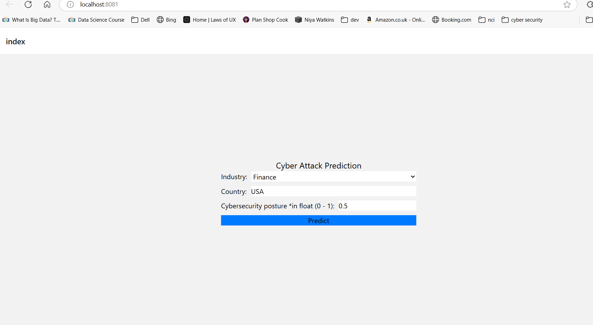

# Welcome to cyber attack predictor

## Get started

1. Running backend
- from backend folder run the following command to start server
```bash
   - uvicorn app:app --reload --port 8000
   ```

2. Running frontend
- From frontend/my-app folder run the following command to run frontend

   ```bash
   npm run web
   ```
- In browser, open http://localhost:8081/ 


3. Countries supported currently are - 'USA', 'UK', 'Germany', 'India', 'China', 'Russia', 'Brazil', 'France'
Application will throw error for any other country



